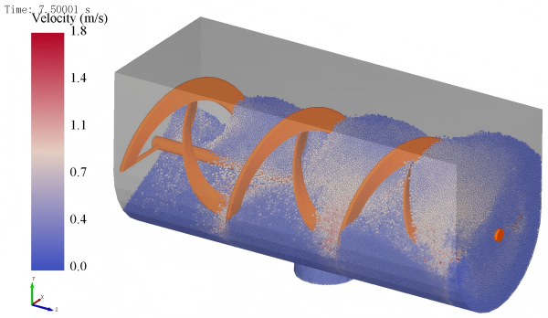
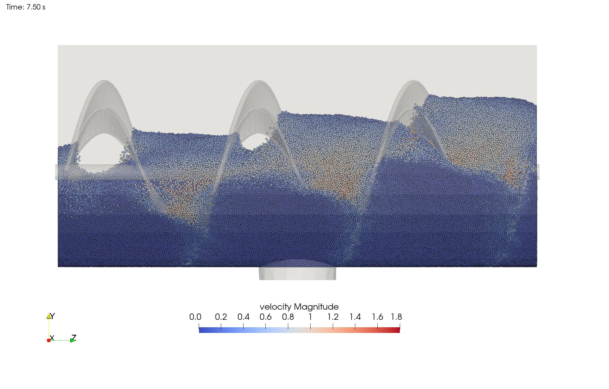
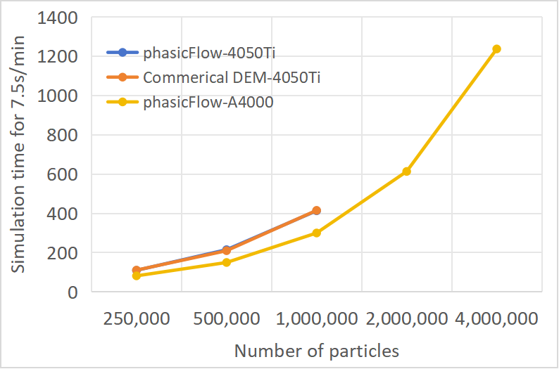

# Helical Mixer Benchmark (phasicFlow v-1.0)

## Overview

This benchmark compares the performance of phasicFlow with a well-stablished commercial DEM software for simulating a helical mixer with varying particle counts (250k to 4M particles). The benchmark measures both computational efficiency and memory usage across different hardware configurations.

**Summary of Results:**

- phasicFlow achieves similar performance to the commercial DEM software on the same hardware.
- phasicFlow shows a 30% performance improvement when using the NVIDIA RTX A4000 compared to the RTX 4050Ti.
- Memory usage is approximately 50% lower in phasicFlow compared to the commercial software, with phasicFlow using about 0.7 GB of memory per million particles, while the commercial software uses about 1.5 GB per million particles.

## Simulation Setup

    
    
  
        
Figure 1. Commercial DEM simulation snapshot

    

    
    
  
        
Figure 2. phasicFlow simulation snapshot and visualized using Paraview

    

### Hardware Specifications

    Table 1. Hardware specifications used for benchmarking.

|  System     |           CPU            |             GPU              | Operating System |
| :---------: | :----------------------: | :--------------------------: | :--------------: |
|   Laptop    | Intel i9-13900HX 2.2 GHz | NVIDIA GeForce RTX 4050Ti 6G | Windows 11 24H2  |
| Workstation | Intel Xeon 4210 2.2 GHz  |     NVIDIA RTX A4000 16G     |   Ubuntu 22.04   |

### Simulation Parameters

    Table 2. Parameters for helical mixer simulations.

| Case     | Particle Diameter | Particle Count | 
| :-------: | :---------------: | :--------------: | 
| 250k     | 6 mm              | 250,000        | 
| 500k     | 5 mm              | 500,000        | 
| 1M       | 4 mm              | 1,000,000      | 
| 2M       | 3 mm              | 2,000,000      | 
| 4M       | 2 mm              | 4,000,000      |

The time step for all simulations was set to 1.0e-5 seconds and the simulation ran for 7.5 seconds.

## Performance Comparison

### Execution Time

    Table 3. Total calculation time (minutes) for different configurations.

|     Software      | 250k   | 500k   | 1M     | 2M     | 4M     | 
| :---------------: | :----: | :-----: | :-----: | :-----: | :-----: |
| phasicFlow-4050Ti | 110 min | 215 min | 413 min | - | -       | 
| Commercial DEM-4050Ti | 111 min | 210 min | 415 min | - | -       | 
| phasicFlow-A4000  | 82 min | 150 min  | 300 min | 613 min | 1236 min |

The execution time scales linearly with particle count. phasicFlow demonstrates approximately:

- the computing speed is basically the same as well-established commercial DEM software on the same hardware
- 30% performance improvement when using the NVIDIA RTX A4000 compared to the RTX 4050Ti

    
    
Figure 3. Calculation time comparison between phasicFlow and the well-established commercial DEM software.

### Memory Usage

    Table 4. Memory consumption for different configurations.

|     Software      | 250k   | 500k   | 1M      | 2M      | 4M      | 
| :---------------: | :-----: | :-----: | :-----: | :-----: | :-----: | 
| phasicFlow-4050Ti | 260 MB  | 404 MB  | 710 MB  | - | -       | 
| Commercial DEM-4050Ti | 460 MB | 920 MB | 1574 MB | - | -       | 
| phasicFlow-A4000  | 352 MB  | 496 MB  | 802 MB  | 1376 MB | 2310 MB |

Memory efficiency comparison:

- phasicFlow uses approximately 0.7 GB of memory per million particles
- Commercial DEM software uses approximately 1.5 GB of memory per million particles
- phasicFlow shows ~50% lower memory consumption compared to the commercial alternative
- The memory usage scales linearly with particle count in both software packages. But due to memory limitations on GPUs, it is possible to run larger simulation on GPUs with phasicFlow.

## Run Your Own Benchmarks

The simulation case setup files are available in this folder for users interested in performing similar benchmarks on their own hardware. These files can be used to reproduce the tests and compare performance across different systems.
