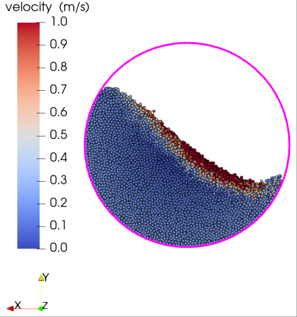

# Rotating Drum Benchmark (phasicFlow v-1.0)

## Overview

This benchmark compares the performance of phasicFlow with a well-stablished commercial DEM software for simulating a rotating drum with varying particle counts (250k to 8M particles). The benchmark measures both computational efficiency and memory usage across different hardware configurations.

## Simulation Setup

    
    
  
        
Figure 1. Commercial DEM simulation snapshot

    

    
    
  
        
Figure 2. phasicFlow simulation snapshot

    

### Hardware Specifications

    Table 1. Hardware specifications used for benchmarking.

|  System     |           CPU            |             GPU              | Operating System |
| :---------: | :----------------------: | :--------------------------: | :--------------: |
|   Laptop    | Intel i9-13900HX 2.2 GHz | NVIDIA GeForce RTX 4050Ti 6G | Windows 11 24H2  |
| Workstation | Intel Xeon 4210 2.2 GHz  |     NVIDIA RTX A4000 16G     |   Ubuntu 22.04   |

### Simulation Parameters

    Table 2. Parameters for rotating drum simulations.

| Case     | Particle Diameter | Particle Count | Drum Length | Drum Radius |
| :-------: | :---------------: | :--------------: | :------------------: | :------------------: |
| 250k     | 6 mm              | 250,000        | 0.8 m       | 0.2 m       |
| 500k     | 5 mm              | 500,000        | 0.8 m       | 0.2 m       |
| 1M       | 4 mm              | 1,000,000      | 0.8 m       | 0.2 m       |
| 2M       | 3 mm              | 2,000,000      | 1.2 m       | 0.2 m       |
| 4M       | 3 mm              | 4,000,000      | 1.6 m       | 0.2 m       |
| 8M       | 2 mm              | 8,000,000      | 1.6 m       | 0.2 m       |

The time step for all simulations was set to 1.0e-5 seconds and the simulation ran for 4 seconds.

## Performance Comparison

### Execution Time

    Table 3. Total calculation time (minutes) for different configurations.

|     Software      | 250k   | 500k   | 1M     | 2M     | 4M     | 8M      |
| :---------------: | :----: | :-----: | :-----: | :-----: | :-----: | :------: |
| phasicFlow-4050Ti | 54 min | 111 min | 216 min | 432 min | -       | -        |
| Commercial DEM-4050Ti | 68 min | 136 min | 275 min | 570 min | -       | -        |
| phasicFlow-A4000  | 38 min | 73 min  | 146 min | 293 min | 589 min | 1188 min |

The execution time scales linearly with particle count. phasicFlow demonstrates approximately:

- 20% faster calculation than the well-established commercial DEM software on the same hardware
- 30% performance improvement when using the NVIDIA RTX A4000 compared to the RTX 4050Ti

    
    
Figure 3. Calculation time comparison between phasicFlow and the well-established commercial DEM software.

### Memory Usage

    Table 4. Memory consumption for different configurations.

|     Software      | 250k   | 500k   | 1M      | 2M      | 4M      | 8M      |
| :---------------: | :-----: | :-----: | :-----: | :-----: | :-----: | :-----: |
| phasicFlow-4050Ti | 252 MB  | 412 MB  | 710 MB  | 1292 MB | -       | -       |
| Commercial DEM-4050Ti | 485 MB | 897 MB | 1525 MB | 2724 MB | -       | -       |
| phasicFlow-A4000  | 344 MB  | 480 MB  | 802 MB  | 1386 MB | 2590 MB | 4966 MB |

Memory efficiency comparison:

- phasicFlow uses approximately 0.7 GB of memory per million particles
- Commercial DEM software uses approximately 1.2 GB of memory per million particles
- phasicFlow shows ~42% lower memory consumption compared to the commercial alternative
- The memory usage scales linearly with particle count in both software packages. But due to memory limitations on GPUs, it is possible to run larger simulation on GPUs with phasicFlow.

## Run Your Own Benchmarks

The simulation case setup files are available in this folder for users interested in performing similar benchmarks on their own hardware. These files can be used to reproduce the tests and compare performance across different systems.
