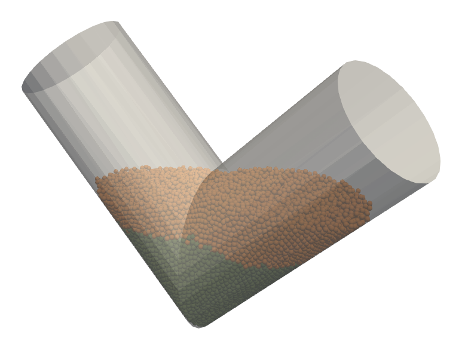

# V-blender Simulation (phasicFlow v-1.0)

This tutorial demonstrates the simulation of a V-blender, a common mixing device used in pharmaceutical and powder processing industries. The V-blender consists of a V-shaped vessel that rotates around a horizontal axis, allowing for efficient mixing of particulate materials.


<div align ="center">
  
  
  <b>
    V-blender simulation with two layers of particles
  </b>
</div>

## Problem Definition

The simulation represents a V-blender with the following characteristics:

- The blender is initially empty and is filled with two different particle types in sequence
- First layer: Small particles (10 mm diameter) are inserted from the right side
- Second layer: Slightly larger particles (10.1 mm diameter) are inserted from the left side
- The blender begins rotation at t = 3.0 s and continues until t = 10.0 s
- The rotation speed is set to 3.14 rad/s (approximately 0.5 Hz or 30 RPM)
- The simulation runs for a total of 10 seconds

## Case Setup

The simulation case setup files are organized in the `settings/` and `caseSetup/` folders.

### Particles Definition

Two particle types are defined in the `caseSetup/shapes` file:

```C++
names       (smallSphere largeSphere);     // names of particles
diameters               (0.01 0.0101);     // diameter of particles (m)
materials         (lightMat lightMat);     // material names for particles
```

Both particle types share the same material properties but differ slightly in size to allow for visual distinction during mixing.

### Particle Insertion

Particles are inserted in two sequential phases, as defined in `caseSetup/particleInsertion`:

```C++
active              Yes;      // is insertion active -> Yes or No

rightregion
{
    timeControl    simulationTime;    // Controls insertion based on simulation time
    
    regionType     cylinder;          // Defines a cylindrical insertion region
    
    rate           10000;             // Inserts 10,000 particles per second
    
    startTime      0.0;               // Starts inserting at t = 0s (beginning of simulation)
    
    endTime        1.0;               // Stops inserting at t = 1s
    
    insertionInterval 0.025;          // Inserts particles every 0.025s
                                      // (40 insertion events during the 1s period)
    
    cylinderInfo {
        // Defines cylinder endpoints and radius
        p1 (0.0950615  0.12 0.5011585);  // First endpoint coordinates (x,y,z) in meters
        p2 (0.1150615  0.12 0.4811585);  // Second endpoint coordinates (x,y,z) in meters
        radius 0.1;                       // Cylinder radius in meters
    }
    
    setFields {
        // Initial properties for inserted particles
        velocity realx3 (1.2 0.0 -1.2);   // Initial velocity vector (x,y,z) in m/s
                                          // Particles move to the right and downward
    }
    
    mixture {
        // Particle type distribution
        smallSphere 1;                    // 100% of inserted particles are "smallSphere" type
    }
}

leftregion
{
    timeControl    simulationTime;    // Controls insertion based on simulation time
    
    regionType     cylinder;          // Defines a cylindrical insertion region
    
    rate           10000;             // Inserts 10,000 particles per second
    
    startTime      1.5;               // Starts inserting at t = 1.5s
                                      // (after the first insertion phase)
    
    endTime        2.5;               // Stops inserting at t = 2.5s
    
    insertionInterval 0.025;          // Inserts particles every 0.025s
                                      // (40 insertion events during the 1s period)
    
    cylinderInfo {
        // Defines cylinder endpoints and radius
        p1 (0.7562545 0.12 0.50079);    // First endpoint coordinates (x,y,z) in meters
        p2 (0.7362545 0.12 0.48079);    // Second endpoint coordinates (x,y,z) in meters
        radius 0.1;                      // Cylinder radius in meters
    }
    
    setFields {
        // Initial properties for inserted particles
        velocity realx3 (-1.2 0.0 -1.2); // Initial velocity vector (x,y,z) in m/s
                                         // Particles move to the left and downward
    }
    
    mixture {
        // Particle type distribution
        largeSphere 1;                   // 100% of inserted particles are "largeSphere" type
    }
}
```

#### Detailed Explanation of Insertion Parameters

1. **`rightregion` Dictionary**:
   - Creates a cylindrical insertion region on the right side of the V-blender
   - Active during t=0s to t=1s at the beginning of the simulation
   - Particles are inserted from randomly generated positions within the cylinder
   - Inserts "smallSphere" particles with 10mm diameter
   - Initial velocity (1.2, 0.0, -1.2) m/s directs particles toward the center and bottom of the blender
   - 40 insertion events occur (every 0.025s), each adding approximately 250 particles

2. **`leftregion` Dictionary**:
   - Creates a symmetrical cylindrical insertion region on the left side of the V-blender
   - Active during t=1.5s to t=2.5s, after the first batch of particles has settled
   - Inserts "largeSphere" particles with 10.1mm diameter
   - Initial velocity (-1.2, 0.0, -1.2) m/s directs particles toward the center and bottom of the blender
   - Mirror image of the first insertion but with slightly larger particles

3. **Insertion Region Selection**:
   - Cylindrical insertion regions are positioned above each arm of the V-blender
   - This arrangement ensures particles fall naturally into the V-blender without initial overlap

4. **Timing Strategy**:
   - Sequential insertion with a 0.5s gap between phases allows the first batch to settle
   - All particles settle for 0.5s after the second insertion (t=2.5s to t=3.0s)
   - Blender rotation begins after all particles have settled (t=3.0s)

### Geometry and Motion

The V-blender geometry is defined in `settings/geometryDict` using an STL file:

```C++
motionModel rotatingAxis;                        // motion model: rotating object around an axis

rotatingAxisInfo                                 // information for rotatingAxis motion model 
{
    rotAxis 
    {  
        p1 (0.128228 0.116446 0.297901);         // first point for the axis of rotation
        p2 (0.722596 0.116459 0.297901);         // second point for the axis of rotation
        omega                      3.14;         // rotation speed (rad/s)
        startTime                     3;         // start time of rotation
        endTime                      10;         // end time of rotation
    }
}
```

The blender starts rotating at t = 3.0 s, after both particle types have been inserted and allowed to settle.

### Simulation Domain and Boundaries

The simulation domain is defined in `settings/domainDict`:

```C++
globalBox                                        
{
    min  (-0.1 -0.4 0);       // lower corner point of the box 
    max (0.86 0.6 0.6);       // upper corner point of the box 
}
```

All boundaries are set to "exit" type, meaning particles that go outside the domain will be deleted.

### Particle Interaction Properties

Material properties and interaction parameters are defined in `caseSetup/interaction`:

```C++
materials        (wallMat lightMat);        // a list of materials names
densities               (1000 1000);        // density of materials [kg/m3]

// Contact force models
model
{
    contactForceModel    nonLinearNonLimited;
    rollingFrictionModel              normal;
    
    // Material properties
    Yeff (1.0e6 1.0e6 
                1.0e6);      // Young modulus [Pa]
    Geff (0.8e6 0.8e6 
                0.8e6);      // Shear modulus [Pa]
    nu   (0.25  0.25 
                0.25);         // Poisson's ratio [-]
    en   (0.97  0.85 
                0.97);         // coefficient of normal restitution
    mu   (0.65  0.35 
                0.65);         // dynamic friction
    mur  (0.1   0.1 
                0.1);            // rolling friction
}
```

## Running the Simulation

To run this simulation, execute the following commands in sequence:

1. First, create the geometry:

   ```
   geometryPhasicFlow
   ```

2. Next, initialize the particle system (note: starts with zero particles):
   ```
   particlesPhasicFlow
   ```

3. Finally, run the simulation:

   ```
   sphereGranFlow
   ```

The simulation will automatically insert particles according to the defined schedule and begin rotating the V-blender at the specified time.

## Visualizing Results

After the simulation completes, you can convert the results to VTK format for visualization:

```
pFlowToVTK  --binary 
```

The VTK files will be stored in a new directory called `./VTK` and can be visualized using tools like ParaView or VisIt.

## Expected Behavior

During the simulation, you should observe:
1. Initial filling with small particles from the right side (0-1s)
2. A brief settling period (1-1.5s)
3. Filling with large particles from the left side (1.5-2.5s)
4. Another settling period (2.5-3s)
5. Rotation of the V-blender causing mixing of the two particle types (3-10s)
