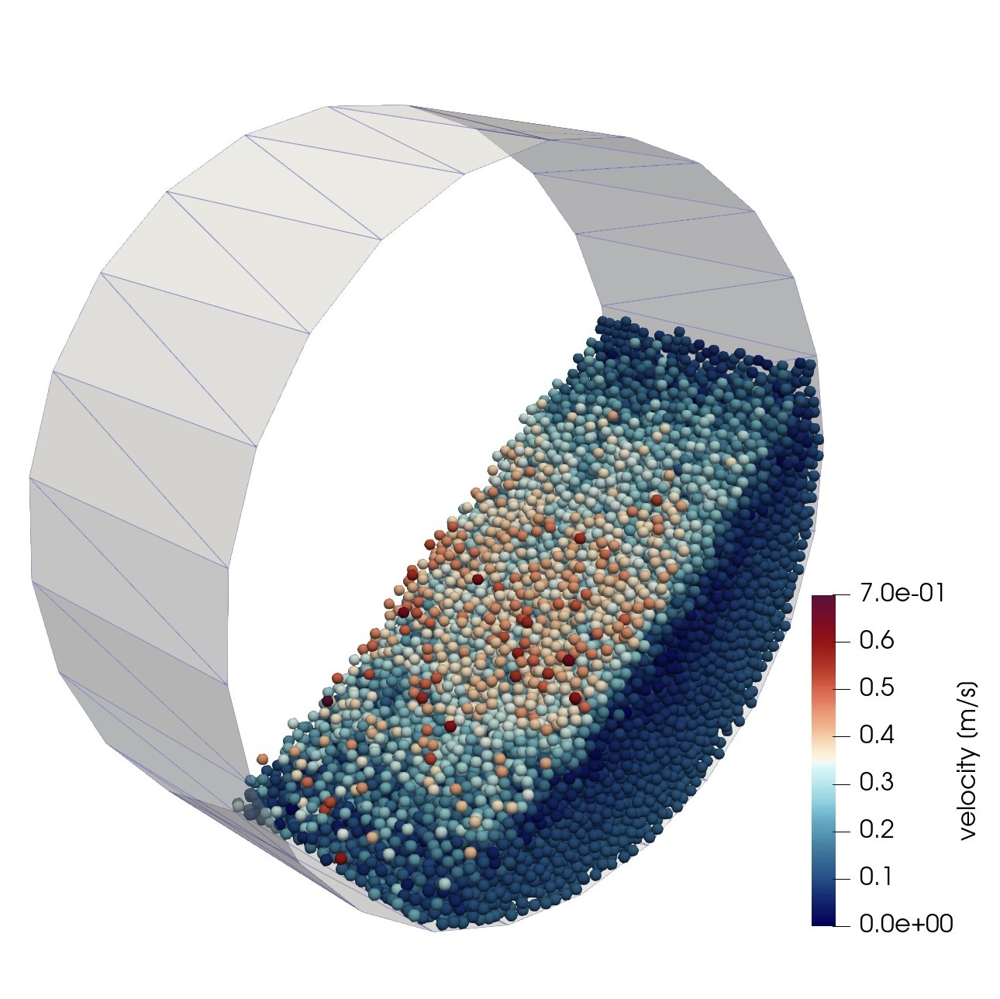

# Simulating a Rotating Drum with Periodic Boundary Type (v-1.0)
## Problem Definition
The problem is to simulate a rotating drum with a diameter of 0.24 m and a length of 0.1 m, rotating at 11.6 rpm. It is filled with 4-mm spherical particles at a rate of 10,000 particles/s for 2 seconds (a total of 20,000 particles). The timestep for integration is 0.00001 s. We use the `periodic` boundary type in the z-direction to replicate the same drum on both sides (a drum with an infinite length).

<div align="center">
<b>

</b>
<b>

A View of Rotating Drum with Periodic Boundary
</b></div>

***

## Setting Up the Case 
Everything is similar to the tutorial on [simulating a small rotating drum](../rotatingDrumSmall), except that the drum does not have the two end plates (it is open from both sides), and we use particle insertion for inserting particles. So, if you don't know how to simulate a rotating drum, first review that tutorial. 

Since the goal here is to show you how to use the periodic boundary type, we only review the `domainDict` here. 

<div align="center"> 
in <b>settings/domainDict</b> file
</div>

```C++
// Simulation domain: every particle that goes outside this domain will be deleted
globalBox                                        
{
    min (-0.12 -0.12 0.0);  // lower corner point of the box 

    max (0.12   0.12 0.1);  // upper corner point of the box 
}

boundaries
{

	left // x-
	{
		type     exit;     
	}

	right // x+
	{
		type     exit;    
	}

	bottom // y-
	{
		type     exit;   
	}

	top // y+
	{
		type     exit;    
	}

	rear // z-
	{
		type     periodic;   // this boundary type should be defined on both z+ and z- sides
	}

	front // z+
	{
		type     periodic;   // this boundary type should be defined on both z+ and z- sides
	}
}
```
`globalBox` defines a cuboid with two corner points `min` and `max`. If a particle falls out of this box, it is automatically deleted. So, this box should contain everything in the simulation and should be as small as possible. 

`front` and `rear` boundaries represent the front and rear planes of this `globalBox`. If we want to have a periodic boundary in the z direction, we should set the type of boundary to `periodic` for both `front` and `rear` boundaries.  

## Running the Case 
The solver for this simulation is `sphereGranFlow`. Enter the following commands in the terminal. Depending on the computational power, it may take a few minutes to a few hours to complete. 

```
geometryPhasicFlow
particlesPhasicFlow
sphereGranFlow
```

## Post Processing 
After finishing the simulation, you can render the results in ParaView. To convert the results to VTK format, just enter the following command in the terminal. This will convert all the results (particles and geometry) to VTK format and store them in the `VTK/` folder. 

```
pFlowToVTK --binary
```
