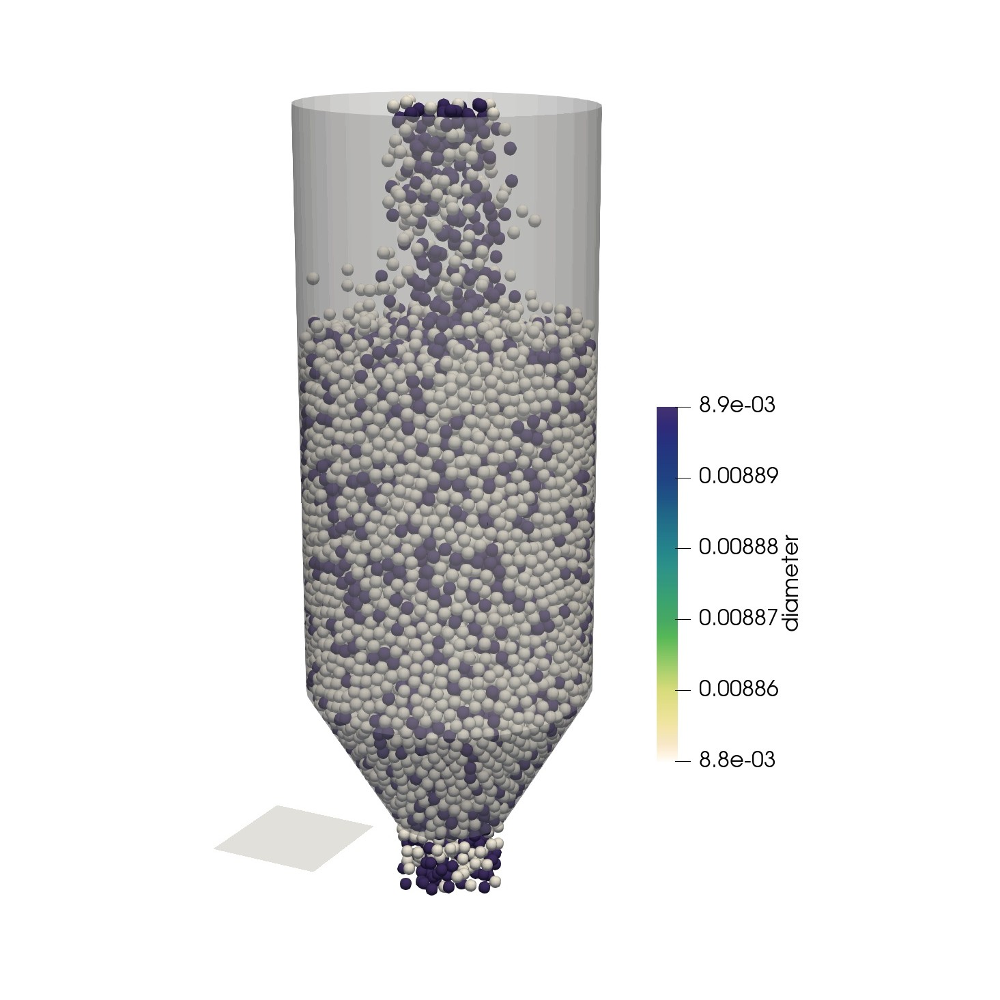

# Simulating a Simple Homogenization Silo Using Periodic Boundary (v-1.0)

## Problem
A homogenization silo is used to mix particles inside a silo using the circulation of particles. A pneumatic conveying system carries particles from the exit and re-enters them from the top. Here, we use a `periodic` boundary to simulate the action of the pneumatic conveyor system for circulating particles. Particles exiting from the bottom are re-entered from the top using this boundary (`periodic`).

The simulation case setup is essentially similar to the [`layeredSiloFilling`](../layeredSiloFilling/) tutorial. There is also another change with regard to `layeredSiloFilling`. The exit gate is opened after the filling phase of the silo (see `settings/geometryDict` for more details).

<b>

A view of the homogenization silo
</b>

***

