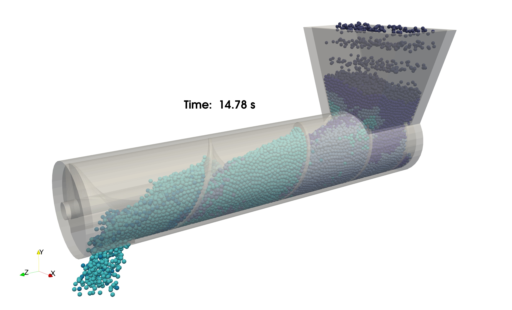

# Simulating a Screw Conveyor (v-1.0)

## Problem Definition

The problem is to simulate a screw conveyor with a diameter of 0.2 m and a length of 1 m with a variable pitch. It is filled with 10 mm and 9 mm spherical particles. The timestep for integration is 0.00002 s. Particles are inserted from the top of the feeder at a rate of 2800 particles/s. The number composition of large and small particles is 2:1.

<div align="center">


<b>

A view of the screw conveyor simulation
</b>
</div>

***

## Setting Up the Case

PhasicFlow simulation case setup is based on the text-based scripts provided in two folders located in the simulation case folder: `settings` and `caseSetup`. All commands should be entered in the terminal while the current working directory is the simulation case folder (at the top level of `caseSetup` and `settings`).

### Creating Particles

Open the file `settings/particlesDict`. Two dictionaries, `positionParticles` and `setFields`, position particles and set the field values for the particles. In the dictionary `positionParticles`, the positioning `method` is `empty`, which means that there are no particles in the simulation at the start.

<div align="center"> 
in <b>settings/particlesDict</b> file
</div>

```C++
positionParticles
{
	// A list of options are: ordered, random
	method empty;     		// creates the required fields with zero particles (empty). 

	mortonSorting 			Yes;    // perform initial sorting based on morton    
}
```

Enter the following command in the terminal to create the particles and store them in the `0` folder:

`> particlesPhasicFlow`

### Creating Geometry

In the file `settings/geometryDict`, you can provide information for creating geometry. Each simulation should have a `motionModel` that defines a model for moving the surfaces in the simulation. The `rotatingAxis` model defines a fixed axis which rotates around itself. The dictionary `rotAxis` defines a motion component with `p1` and `p2` as the endpoints of the axis and `omega` as the rotation speed in rad/s. You can define more than one motion component in a simulation.

<div align="center"> 
in <b>settings/geometryDict</b> file
</div>

```C++
motionModel rotatingAxisMotion; 

rotatingAxisMotionInfo
{
	rotAxis 
	{
		p1        (0 0 0.0); // first point for the axis of rotation 
		p2        (0 0 1.0); // second point for the axis of rotation
		omega     3.14; 	 // rotation speed (rad/s)
		startTime 1;         // when t>1 s, rotation starts 
		endTime   30;        // when t>30 s, rotation stops
	}
}
```

In the dictionary `surfaces`, you can define all the surfaces in the simulation. Two main options are available: built-in geometries in PhasicFlow, and providing surfaces with an STL file (ASCII format). Here we use `stlWall` as a method to provide the surface information through STL files. In the `shell` dictionary, `material` is set to `prop1` and `motion` is set to `none` (meaning this surface is fixed). `helix` defines the screw at the center of the cylindrical part of the shell. For this surface, `material` is set to `prop1` and `motion` is set to `rotAxis`.

<div align="center"> 
in <b>settings/geometryDict</b> file
</div>

```C++
surfaces
{
	helix
	{
		type 	 stlWall;  	// type of the wall
		file 	 screw.stl;	// file name in stl folder		
		material prop1;     // material name of this wall
		motion 	 rotAxis;	// motion component name 
	}

	shell
	{
		type 	 stlWall;  	// type of the wall
		file 	 shell.stl;	// file name in stl folder		
		material prop1;     // material name of this wall
		motion 	 none;		// this surface is not moving ==> none
	}
}
```

Enter the following command in the terminal to create the geometry and store it in the `0/geometry` folder:

`> geometryPhasicFlow`

### Defining Properties and Interactions

In the file `caseSetup/interaction`, you will find properties of materials. `materials` defines a list of material names in the simulation and `densities` sets the corresponding density of each material name. The `model` dictionary defines the interaction model for particle-particle and particle-wall interactions. `contactForceModel` selects the model for mechanical contacts (here nonlinear model with limited tangential displacement) and `rollingFrictionModel` selects the model for calculating rolling friction. Other required properties should be defined in this dictionary.

<div align="center"> 
in <b>caseSetup/interaction</b> file
</div>

```C++
materials      (prop1);    // a list of materials names
densities      (2300.0);   // density of materials [kg/m3]

contactListType   sortedContactList; 

model
{
   contactForceModel    nonLinearNonLimited;

   rollingFrictionModel normal;

   Yeff  (1.0e6);       // Young modulus [Pa]

   Geff  (0.8e6);       // Shear modulus [Pa]

   nu    (0.25);        // Poisson's ratio [-]

   en    (0.8);         // coefficient of normal restitution 

   mu    (0.3);         // dynamic friction 

   mur   (0.2);         // rolling friction 
}
```

The dictionary `contactSearch` sets the methods for broad search. `method` specifies the algorithm for finding the neighbor list for particle-particle contacts. `updateInterval` sets the intervals (in terms of the number of iterations) between each occurrence of updating the neighbor list, and `sizeRatio` sets the size of enlarged cells (with respect to particle diameter) for finding the neighbor list. A larger `sizeRatio` includes more particles in the neighbor list, requiring less frequent updates.

<div align="center"> 
in <b>caseSetup/interaction</b> file
</div>

```C++
contactSearch
{
    method          NBS;   // method for broad search 
    
    updateInterval   10;

    sizeRatio       1.1;

    cellExtent     0.55;

    adjustableBox   Yes;
}
```

In the file `caseSetup/shapes`, you can define a list of `names` for shapes, a list of `diameters` for shapes, and their `materials` names.

<div align="center"> 
in <b>caseSetup/shapes</b> file
</div>

```C++
names 		(sphere1 sphere2); 	// names of shapes 
diameters 	(0.01  	 0.009);	// diameter of shapes 
materials	(prop1   prop1);	// material names for shapes 
```

Other settings for the simulation can be set in the file `settings/settingsDict`. The dictionary `domain` defines a rectangular bounding box with two corner points for the simulation. Each particle that gets out of this box will be deleted automatically.

<div align="center"> 
in <b>settings/settingsDict</b> file
</div>

```C++
dt 				0.00002; 	// time step for integration (s)

startTime 		0; 			// start time for simulation 

endTime 		20;	 		// end time for simulation 

saveInterval 	0.025; 		// time interval for saving the simulation

timePrecision   4;			// maximum number of digits for time folder 

g 				(0 -9.8 0); // gravity vector (m/s2) 

writeFormat 	binary;     // field files will be saved in binary format
...
```

## Running the Case

The solver for this simulation is `sphereGranFlow`. Enter the following command in the terminal. Depending on the computational power, it may take a few minutes to a few hours to complete:

`> sphereGranFlow`

## Post Processing

After finishing the simulation, you can render the results in ParaView. To convert the results to VTK format, enter the following command in the terminal. This will convert all the results (particles and geometry) to VTK format and store them in the `VTK/` folder:

`> pFlowToVTK --binary  -f diameter id velocity`
