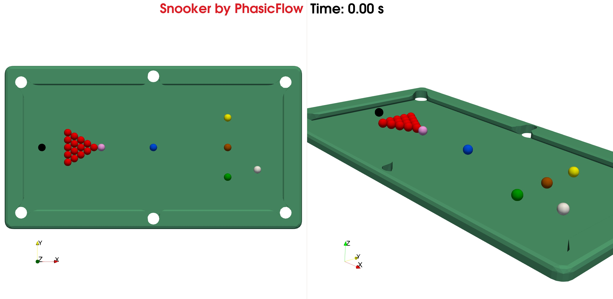

# Snooker break-off shot by PhasicFlow (v-1.0)

This simulation demonstrates a snooker break-off shot using the PhasicFlow solver, `sphereGranFlow`. The simulation is set up to model the dynamics of a snooker table, including the interactions between the cue ball and the other balls on the table. To run the simulation, just execute the following command in the terminal:

```bash
./runThisCase
```

**Important Note:** The physical properties including dynamic friction and restitution coefficients are set to approximate real-world values for a snooker table. However, the simulation may not perfectly replicate real-world physics due to inaccurate properties in the model.

<div align="center">
<b>
A view of snooker table
</b>
<div>

</div>
</div>

***
